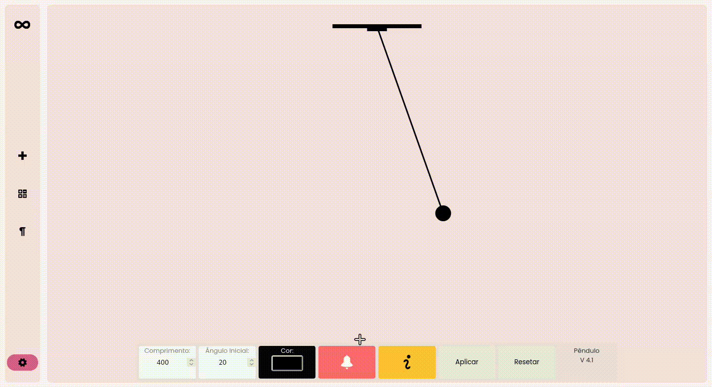

# SSI (Software Simulador Informacional)
> Simulador educacional desenvolvido para auxiliar estudantes do 2.º ano do ensino médio no aprendizado de conceitos de Física por meio de simulações visuais e interativas.

---

## Sobre o projeto

O **SSI — Software Simulador Informacional** é um software educacional que contempla um conjunto de simulações interativas voltadas ao ensino de fenômenos físicos clássicos.

O objetivo do sistema é permitir que o usuário visualize e manipule parâmetros físicos, observando o comportamento dinâmico dos sistemas estudados, servindo como ferramenta de apoio ao ensino tradicional de Física.

---

## Destaques acadêmicos

Este projeto foi reconhecido em eventos acadêmicos e científicos:

- 🏆 **XIV CONNEPI (2024)** — Congresso Norte Nordeste de Pesquisa e Inovação  
- 🔬 **SECITEC (2023)** — Semana de Ciência e Tecnologia do IFBA  
- 📄 **Artigo científico** desenvolvido como trabalho final de conclusão de curso  

---

## Objetivos

- Facilitar a compreensão de conceitos físicos abstratos
- Promover o aprendizado ativo por meio de simulações  
- Integrar tecnologia e educação de forma prática e simples
- Apoiar estudantes e professores em ambientes educacionais  

---

## Demonstração

As imagens abaixo apresentam a interface do simulador e exemplos de interações durante a execução do sistema.

---

## Movimento Harmônico Simples (MHS)

O SSI inclui simulações de **Movimento Harmônico Simples**, abordando dois sistemas fundamentais da Física.

### Pêndulo simples

A simulação do pêndulo simples permite a análise do movimento oscilatório por meio da variação de parâmetros como:

- Comprimento do fio  
- Massa do corpo  

É possível observar o período, a frequência e o comportamento do sistema ao longo do tempo.

### Sistema massa–mola
O sistema massa–mola simula a oscilação de um bloco acoplado a uma mola ideal, permitindo ao usuário:

- Alterar o comprimento da mola 
- Modificar a massa  
- Ajustar condições iniciais  

A simulação auxilia na compreensão das leis que regem o Movimento Harmônico Simples e da relação entre força restauradora e deslocamento.

---

## Sistema Solar

Além dos sistemas oscilatórios, o SSI apresenta uma simulação do **Sistema Solar**, com representação visual dos corpos celestes e seus movimentos orbitais.

Essa simulação possibilita a observação das interações gravitacionais, trajetórias orbitais e relações espaciais entre os planetas, contribuindo para o entendimento de conceitos básicos de mecânica celeste e gravitação.

---

## Aplicações educacionais

O SSI pode ser utilizado como ferramenta de apoio em:

- Aulas de Física  
- Ambientes acadêmicos e laboratoriais
- Demonstrações educacionais  
- Estudos autônomos  

isso é tudo... :)

---

